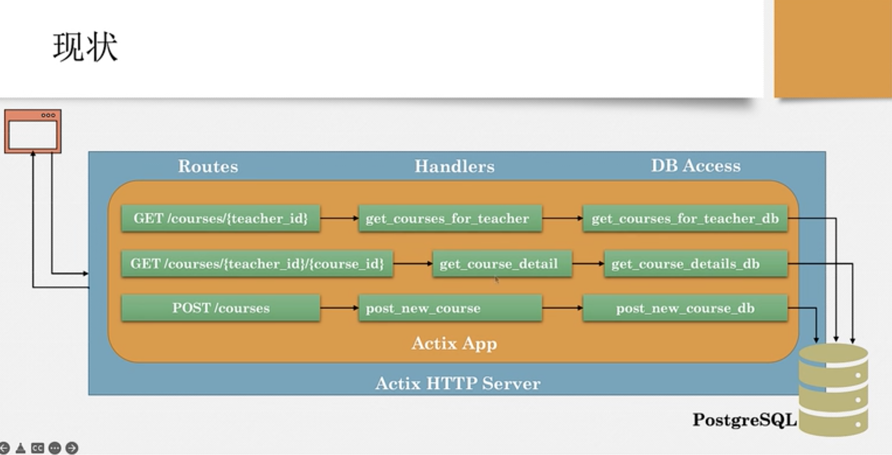

# README
> create by nohi 20230312

## 内容
rust+actix+postgresql demo

## 运行
* 运行`cargo run --bin teacher-service`
* 健康：`curl localhost:3000/health`
* 添加课程：
  
  ```sheel
  curl -X POST localhost:3000/courses/ -H "Content-Type:application/json" -d '{"teacher_id":3,"name":"First course"}'
  ```
* 获取老师所有的课程：`curl localhost:3000/courses/1`
* 获取老师的某一课程： `curl localhost:3000/courses/1/2`


## 过程
* 20240312
  demo基本完成
  前台服务请求 -> Routes -> Handlers -> Db Access
  

* 20240323
  * 新增删除、更新接口